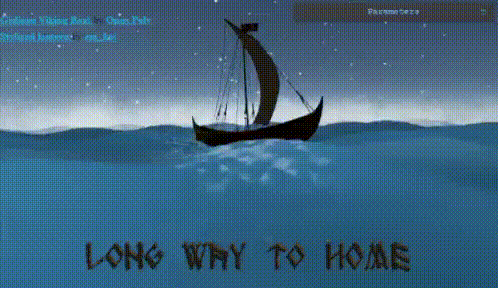
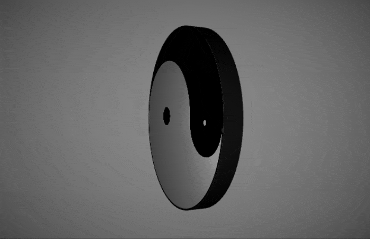
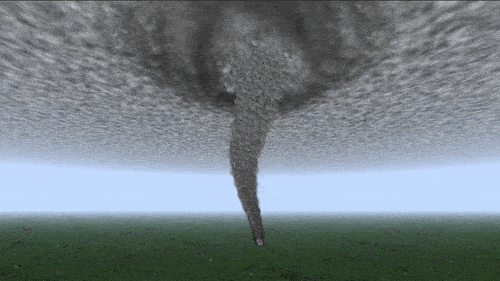
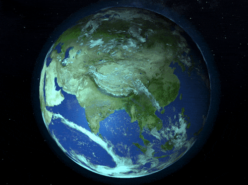
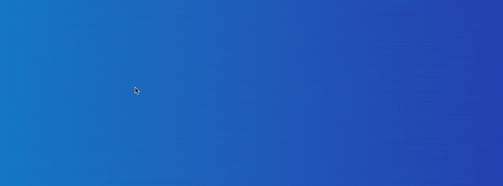
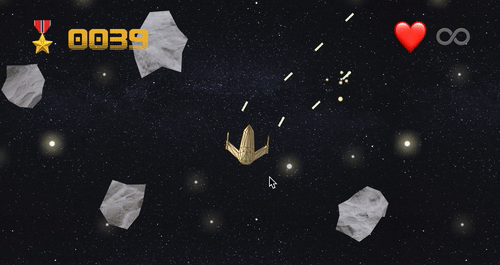
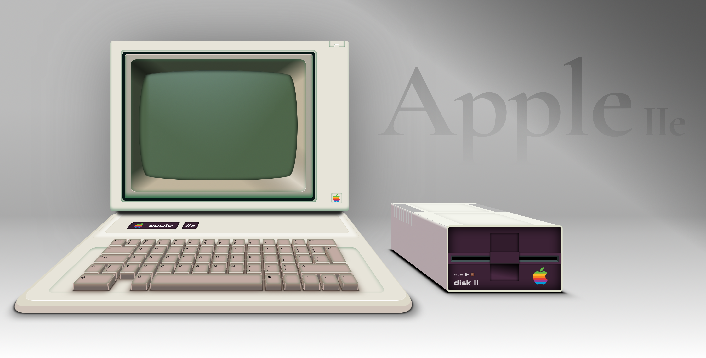
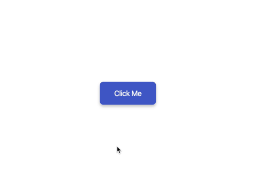

# Slick 😎 UI demos

## Fireworks image tranistion

Live Demo: [link](https://demos.closure.sk/gallery/dist/)

Uses: JS, Three.js, GSAP

## Tetris

Live Demo: [link](https://demos.closure.sk/tetris/build/)

Uses: JS, Three.js, GSAP

## Viking Ship

Live Demo: [link](http://marianban.github.io/sea/index.html)

CodePen: [link](https://codepen.io/marianban/full/MWEogJv)

Uses: JS, Three.js

## Yin and Yang

Live Demo: [link](http://marianban.github.io/yin-and-yang/index.html)

CodePen: [link](https://codepen.io/marianban/full/jOLGOjM)

Uses: JS, Three.js

## Tornado

Uses: JS, Three.js

## Morphing Sphere

Live Demo: [link](http://marianban.github.io/sphere/index.html)

CodePen: [link](https://codepen.io/marianban/full/LYxLpmW)

Uses: JS, Three.js

## 3D Earth

Live Demo: [link](http://marianban.github.io/earth/index.html)

CodePen: [link](https://codepen.io/marianban/full/bGBXmvJ)

Uses: JS, CSS, Three.js

## Candy Text

Live Demo: [link](http://marianban.github.io/candy-text/index.html)

CodePen: [link](https://codepen.io/marianban/full/OJbVLeN)

Uses: JS, CSS, p5.js

## Asteroids

Live Demo: [link](http://marianban.github.io/asteroids/index.html)

CodePen: [link](https://codepen.io/marianban/pen/zYBXGRV)

Uses: JS, CSS, p5.js

## Apple IIe 3D CSS

Live Demo: [link](http://marianban.github.io/apple-IIe/index.html)

CodePen: [link](https://codepen.io/marianban/pen/mdeVBKo)

Uses: JS, CSS

## Underwater Button Effect

Live Demo: [link](http://marianban.github.io/underwater-button-effect/index.html)

## Health Check App

Doesn't work in WebKit (Safari, iOS) 😿

Live Demo: [link](http://marianban.github.io/health-check/index.html)

Original design made by Cosmin Capitanu [link](https://dribbble.com/shots/8584111-Health-Check)

Uses: React, Web Animation API, CSS

## Smart Home App

Live Demo: [link](http://marianban.github.io/smart-home-app/index.html)

Original design made by Michal Parulski [link](https://dribbble.com/shots/6914699-Smart-Home-App)

Uses: React, D3.js, CSS
